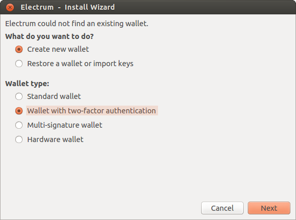
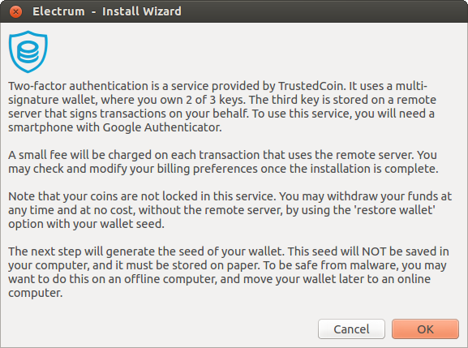
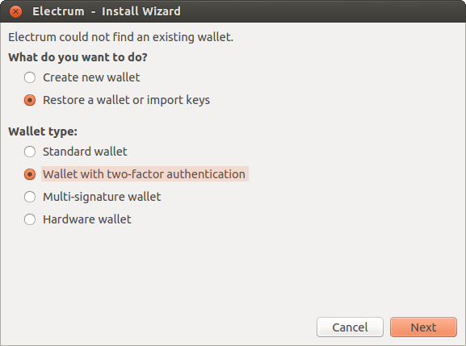

Two Factor Authentication
=========================

Electrum offers two-factor authenticated wallets, with a remote server
acting to co-sign transactions, adding another level of security in
the event of your computer being compromised.

The remote server in question is a service offered by TrustedCoin.
Here is a guide_ on how it works.

.. _guide: https://api.trustedcoin.com/#/electrum-help

Creating a Wallet
-----------------

Restoring from seed
-------------------

Even if TrustedCoin is compromised or taken offline, your coins are
secure as long as you still have the seed of your wallet. Your seed
contains two master private keys in a 2-of-3 security scheme. In
addition, the third master public key can be derived from your seed,
ensuring that your wallet addresses can be restored. In order to
restore your wallet from seed, select "wallet with two factor
authentication", as this tells Electrum to use this special variety of
seed for restoring your wallet.

Note: The "restore" option should be used only if you no longer want
to use TrustedCoin, or if there is a problem with the service. Once
you have restored your wallet in this way, two of three factors are on
your machine, negating the special protection of this type of
wallet.

