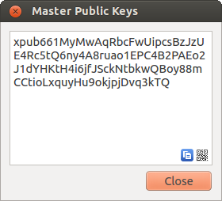
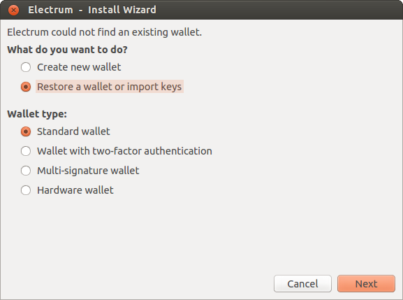
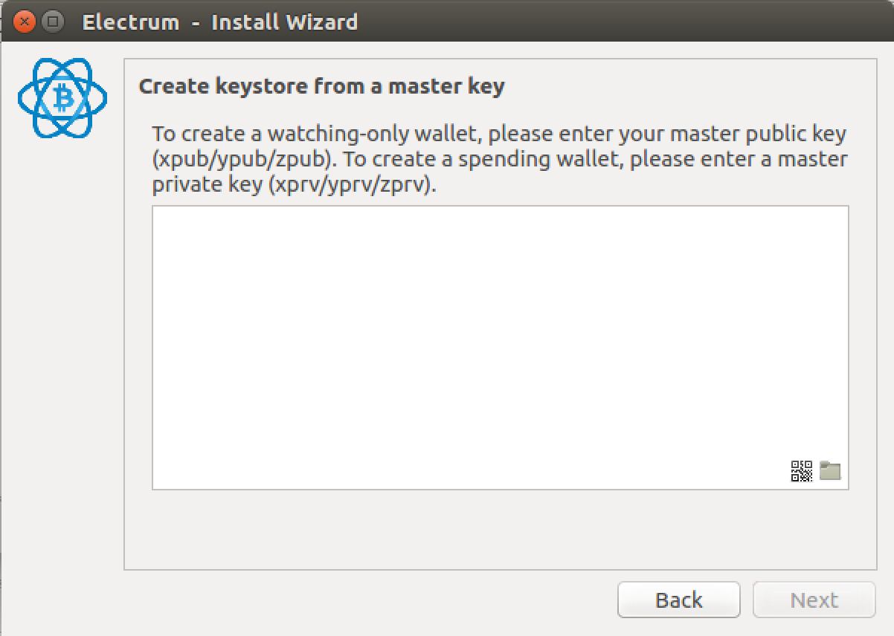
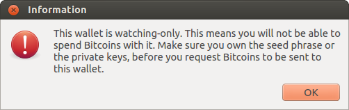
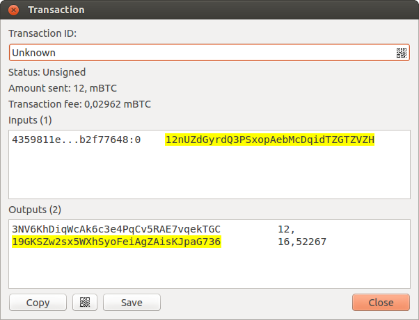
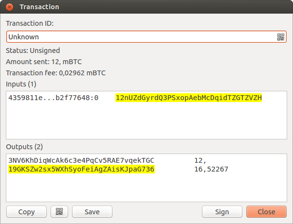
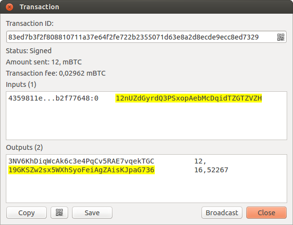

.. _coldstorage:

Cold Storage
============

This document shows how to create an offline wallet that
holds your Bitcoins and a watching-only online wallet that
is used to view its history and to create transactions that
have to be signed with the offline wallet before being
broadcast on the online one.

Create an offline wallet
------------------------

Create a wallet on an offline machine, as per the usual process (file
-> new) etc.

After creating the wallet, go to Wallet -> Master Public Keys.

The Master Public Key of your wallet is the string shown in this popup
window.  Transfer that key to your online machine somehow.

Create a watching-only version of your wallet
---------------------------------------------

On your online machine, open up Electrum and select File ->
New/Restore. Enter a name for the wallet and select "Restore a wallet
or import keys".

Paste your master public key in the box.

Click Next to complete the creation of your wallet. 
When you're done, you should see a popup informing you that you are opening a watching-only wallet.

Then you should see the transaction history of your cold wallet.

Create an unsigned transaction
------------------------------

Go to the "send" tab on your online watching-only wallet,
input the transaction data and press "Send...". A window opens up, informing you that a
transaction fee will be added. Continue.

In the window that opens up, press "save" and save the
transaction file somewhere on your computer. Close the
window and transfer the transaction file to your offline
machine (e.g. with a usb stick).

Get your transaction signed
---------------------------

On your offline wallet, select Tools -> Load transaction -> From file
in the menu and select the transaction file created in the previous
step.

Press "sign". Once the transaction is signed, the Transaction ID
appears in its designated field.

Press save, store the file somewhere on your
computer, and transfer it back to your online machine.

Broadcast your transaction
--------------------------

On your online machine, select Tools -> Load transaction -> From File
from the menu. Select the signed transaction file. In the window that
opens up, press "broadcast". The transaction will be broadcasted over
the Bitcoin network.

