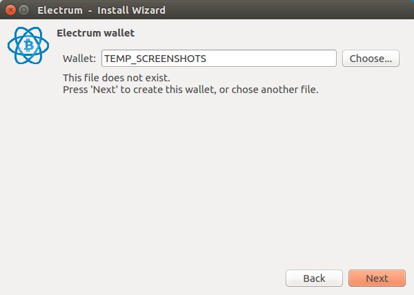
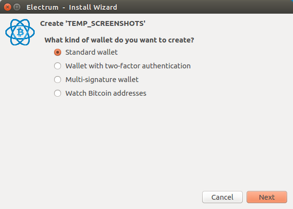
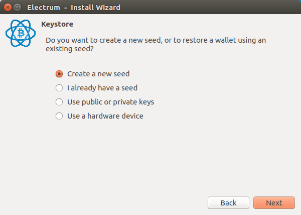
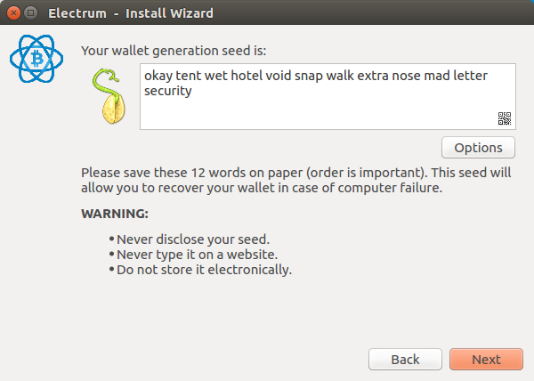
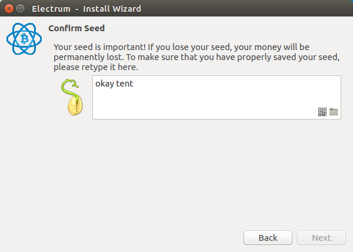
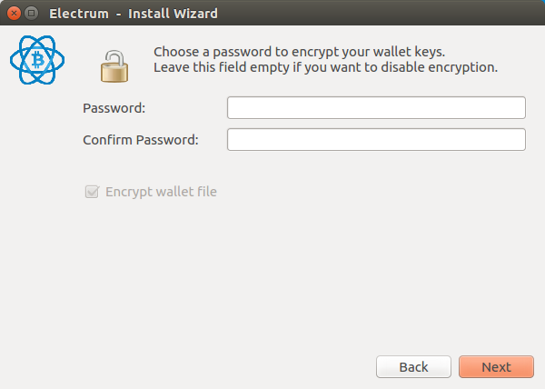
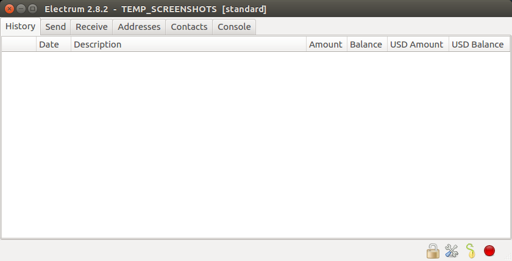

Creating your wallet
====================

Choose a name
-------------

Some people use multiple wallets!  Just make sure it's very clear to avoid confusion!

Choose the wallet type
----------------------

Electrum supports some advanced features.  
Let's stick with the default.

Choose how keys are stored
--------------------------

Electrum supports some advanced features.
Let's stick with the default.

Write down your seed
--------------------

These words can be used to recover your wallet and spend your bitcoin.
Make sure you write these down, make backups, and have multiple copies.

DO NOT SHARE.  KEEP YOURS SAFE.

Confirm your Seed
-----------------

Enter in your seed words to double check you have actually backed them up.

You may encrypt your wallet
---------------------------

You may enter a password here if you want to encrypt your wallet on your computer.
Be careful.  This will not apply to your seed words you wrote down.

You now have a wallet!
----------------------

