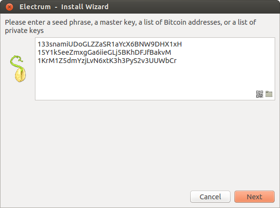
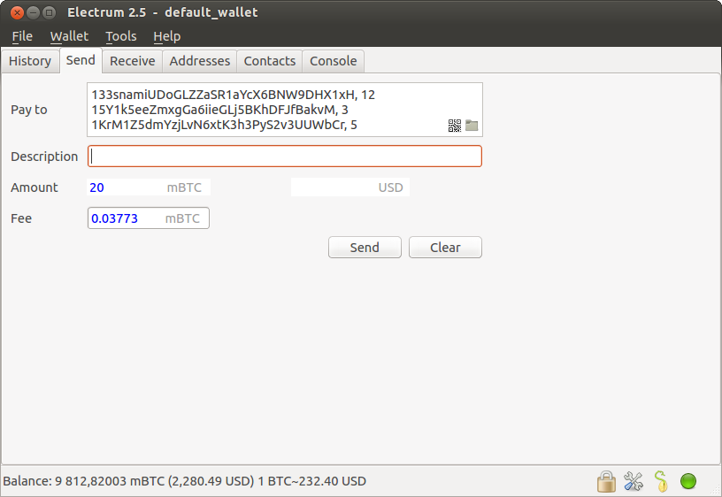

Frequently Asked Questions
==========================

How does Electrum work?
-----------------------

Electrum's focus is speed, with low resource usage and
simplifying Bitcoin. Startup times are instant because it
operates in conjunction with high-performance servers that
handle the most complicated parts of the Bitcoin system.

Does Electrum trust servers?
----------------------------

Not really; the Electrum client never sends private keys
to the servers. In addition, it verifies the information
reported by servers, using a technique called :ref:`Simple Payment Verification <spv>`

What is the Seed?
-----------------

The seed is a random phrase that is used to generate your
private keys.

Example:

.. code-block:: none

   constant forest adore false green weave stop guy fur freeze giggle clock

Your wallet can be entirely recovered from its seed. For this, select
the "restore wallet" option in the startup.

How secure is the seed?
-----------------------

The seed created by Electrum has 128 bits of entropy. This
means that it provides the same level of security as a
Bitcoin private key (of length 256 bits). Indeed, an
elliptic curve key of length n provides n/2 bits of
security.

How can I send the maximum available in my wallet?
--------------------------------------------------

Type an exclamation mark (!) in the Amount field. The fee will be
automatically adjusted for that amount.

How can I send Bitcoins without paying a transaction fee?
---------------------------------------------------------

You can create a transaction with zero fee in the GUI, by
following these steps:

- Activate the option 'set fees manually'
- Enter 0 in the fee field
- Enter the amount in the amount field

Note that transactions without fees might not be relayed by the Electrum server, or by the Bitcoin Network.

What does it mean to "Freeze" an address in Electrum?
-----------------------------------------------------

When you freeze an address, the funds in that address will not be used
for sending bitcoins. You can not send Bitcoins if you don't have
enough funds in the non-frozen addresses.
          

What encryption is used for wallets?
------------------------------------

Electrum uses AES-256-CBC to encrypt the seed and private keys in the
wallet.

I have forgotten my password but still have my seed. Is there any way I can recover my password?
------------------------------------------------------------------------------------------------

No, you cannot recover your password. However, you can still recover
your money: restore your wallet from its seed, and choose a new
password.

Why can I open the wallet without entering my password?
-------------------------------------------------------

Only the seed and private keys are encrypted, and not the entire
wallet file. The private keys are decrypted only briefly, when you
need to sign a transaction; for this you need to enter your
password. This is done in order to minimize the amount of time during
which sensitive information is unencrypted in your computer's
memory.

Does Electrum support cold wallets?
-----------------------------------

Yes. see :ref:`Cold Storage <coldstorage>`

Can I import private keys from other Bitcoin clients?
-----------------------------------------------------

In Electrum 2.0, you cannot import private keys in a wallet that has a
seed. You should sweep them instead.

If you want to import private keys and not sweep them you need to
create a special wallet that does not have a seed.  For this, create a
new wallet, select "restore", and instead of typing your seed, type a
list of private keys, or a list of addresses if you want to create a
watching-only wallet.

You will need to back up this wallet, because it cannot be
recovered from seed.

Can I sweep private keys from other Bitcoin clients?
----------------------------------------------------

Sweeping private keys means to send all the bitcoins they control to
an existing address in your wallet. The private keys you sweep do not
become a part of your wallet.  Instead, all the bitcoins they control
are sent to an address that has been deterministically generated from
your wallet seed.

To sweep private keys go to Wallet menu -> Private Keys ->
Sweep. Enter the private keys in the appropriate field. Leave the
'Address' field unchanged. That is the destination address and it'll
be from your existing electrum wallet.

Where is my wallet file located?
--------------------------------

The default wallet file is called default_wallet which is created when
you first run the application and located under the /wallets folder.

On Windows:

 - Show hidden files
 - Go to \Users\YourUserName\AppData\Roaming\Electrum\wallets

On Mac:

- Open Finder
- Go to folder (shift+cmd+G) and type ~/.electrum

On Linux:

- Home Folder
- Go -> Location and type ~/.electrum

Can I do bulk payments with Electrum?
-------------------------------------

You can create a transaction with several outputs. In the GUI, type
each address and amount on a line, separated by a comma.

Amounts are in the current unit set in the client. The
total is shown in the GUI.

You can also import a CSV file in the 'Pay to' field, by clicking on
the folder icon.

Can Electrum create and sign raw transactions?
----------------------------------------------

Electrum lets you create and sign raw transactions right from the user
interface using a form.

Electrum freezes when I try to send bitcoins
--------------------------------------------

This might happen if you are trying to spend a large number of
transactions outputs (for example, if you have collected hundreds of
donations from a Bitcoin faucet).  When you send Bitcoins, Electrum
looks for unspent coins that are in your wallet, in order to create a
new transaction. Unspent coins can have different values, much like
physical coins and bills.

If this happens, you should consolidate your transaction inputs, by
sending smaller amounts of bitcoins to one of your wallet addresses;
this would be the equivalent of exchanging a stack of nickels for a
dollar bill.

Is there a way to get a BTC/USD exchange ticker in Electrum?
------------------------------------------------------------

Yes, go to Tools->Plugins and enable 'exchange rates'

.. _gap limit:

What is the gap limit?
----------------------

The gap limit is the maximum number of consecutive unused addresses in
your deterministic sequence of addresses.  Electrum uses it in order
to stop looking for addresses. In Electrum 2.0, it is set to 20 by
default, so the client will get all addresses until 20 unused
addresses are found.
          

How can I pre-generate new addresses?
-------------------------------------

Electrum will generate new addresses as you use them,
until it hits the `gap limit`_

If you need to pre-generate more addresses, you can do so by typing
wallet.create_new_address() in the console. This command will generate
one new address. Note that the address will be shown with a red
background in the address tab, to indicate that it is beyond the gap
limit. The red color will remain until the gap is filled.

WARNING: Addresses beyond the gap limit will not automatically be
recovered from seed. To recover them will require either increasing
the client's gap limit or generating new addresses until the used
addresses are found.

If you wish to generate more than one address, you may use a 'for'
loop. For example, if you wanted to generate 50 addresses, you could
do this:

.. code-block:: python

   for x in range(0, 50):
	print wallet.create_new_address()

How to upgrade Electrum?
------------------------

Warning: always save your wallet seed on paper before
doing an upgrade.

To upgrade Electrum, just install the most recent version.
The way to do this will depend on your OS.

Note that your wallet files are stored separately from the
software, so you can safely remove the old version of the
software if your OS does not do it for you.

Some Electrum upgrades will modify the format of your
wallet files.

For this reason, it is not recommended to downgrade
Electrum to an older version, once you have opened your
wallet file with the new version. The older version will
not always be able to read the new wallet file.

The following issues should be considered when upgrading
Electrum 1.x wallets to Electrum 2.x:

- Electrum 2.x will need to regenerate all of your
  addresses during the upgrade process. Please allow it
  time to complete, and expect it to take a little longer
  than usual for Electrum to be ready.

- The contents of your wallet file will be replaced with
  an Electrum 2 wallet. This means Electrum 1.x will no
  longer be able to use your wallet once the upgrade is
  complete.

- The 'Addresses' tab will not show any addresses the
  first time you launch Electrum 2. This is expected
  behaviour. Restart Electrum 2 after the upgrade is
  complete and your addresses will be available.

- Offline copies of Electrum will not show the
  addresses at all because it cannot synchronize with
  the network. You can force an offline generation of a
  few addresses by typing the following into the
  Console: wallet.synchronize(). When it's complete,
  restart Electrum and your addresses will once again
  be available.
