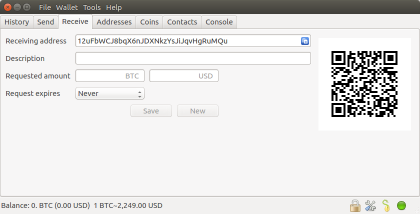

Glossary
========

----

Thin Client
-----------

Electrum's focuses are:
 - Security
 - Recovery
 - Speed

Electrum servers do the heavy lifting. (without compromising security)
Your private keys are never shared with the server, only addresses.
You can even run your own for your devices if you want.

----

Seed Words - KEEP THESE SAFE !!!
----------

Your seed words are used to generate/recover your wallet.

.. code-block:: none

   #Example Seed Words - NEVER SHARE YOURS!
   tango execute day arena female win object expect final tank kingdom web

----

Address
-------

Each seed/wallet will generate all the addresses you'll ever need.  Send these out to receive bitcoin.
It's best to avoid, but you may use the same address indefinitely.  It's typical to organize different addresses for each payment.

----

Transaction ID - TXID
---------------------

When a transaction is created, this ID can be shared to track and prove the transaction.

----

Transaction Fee
---------------

This fee pays for the amount of data in the transaction.  Too low and the transaction will not confirm.
Transactions with the highest fees usually go first.
After a long period of time, unconfirmed transactions will drop as if never having occured.

----

Confirmation
------------

Confirmations occur when a transaction becomes permanently stored on the blockchain.  On average, confirmations will occur every 10 minutes.
Make certain that you have set an appropriate fee so that your transaction will confirm within a reasonable time.

For large transactions, you may want to wait around for multiple confirmations to consider them truly finalized.

