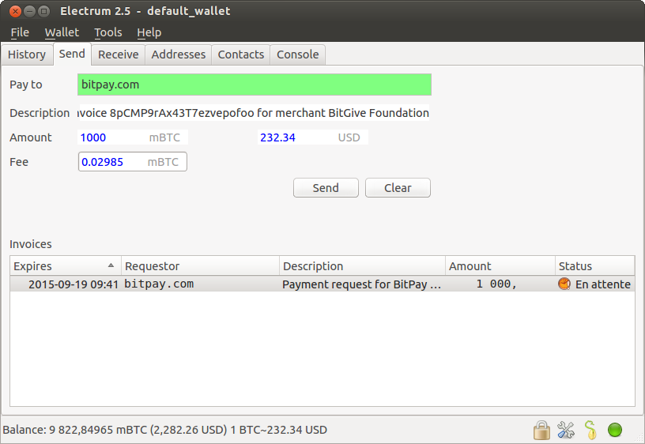

Invoices
========

Invoices are Payment Requests signed by their requestor.

When you click on a bitcoin: link, a URL is passed to
electrum:

.. code-block:: bash

   electrum "bitcoin:1KLxqw4MA5NkG6YP1N4S14akDFCP1vQrKu?amount=1.0&amp;r=https%3A%2F%2Fbitpay.com%2Fi%2FXxaGtEpRSqckRnhsjZwtrA"

This opens the send tab with the payment request:

The green color in the "Pay To" field means that the payment request
was signed by bitpay.com's certificate, and that Electrum verified the
chain of signatures.

Note that the "send" tab contains a list of invoices and their status.

