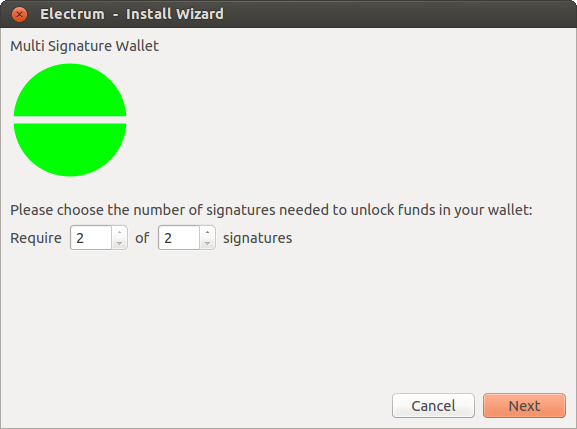
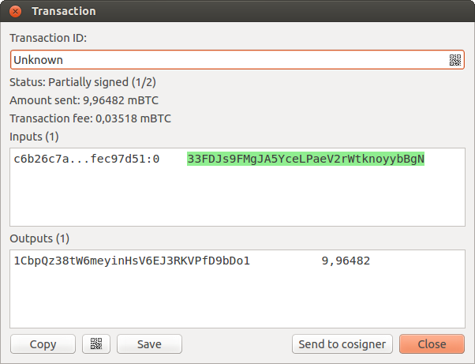
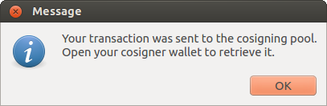
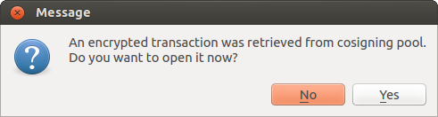

Multisig Wallets
================

This tutorial shows how to create a 2 of 2 multisig wallet. A 2 of 2
multisig consists of 2 separate wallets (usually on separate machines
and potentially controlled by separate people) that have to be used in
conjunction in order to access the funds. Both wallets have the same
set of Addresses.

- A common use-case for this is if you want to collaboratively control
  funds: maybe you and your friend run a company together
  and certain funds should only be spendable if you both
  agree.

- Another one is security: One of the wallets can be on
  your main machine, while the other one is on a offline
  machine. That way you make it very hard for an attacker
  or malware to steal your coins.


Create a pair of 2-of-2 wallets
-------------------------------

Each cosigner needs to do this: In the menu select File->New, then
select "Multi-signature wallet". On the next screen, select 2 of 2.



After generating a seed (keep it safely!) you will need to
provide the master public key of the other wallet.

.. image:: png/create_2of2.png

Put the master public key of the other wallet into the
lower box. Of course when you create the other wallet, you
put the master public key of this one.

You will need to do this in parallel for the two wallets.
Note that you can press cancel during this step, and reopen
the file later.

Receiving
---------

Check that both wallets generate the same set of Addresses. You can
now send to these Addresses (note they start with a "3") with any
wallet that can send to P2SH Addresses.


Spending
--------

To spend coins from a 2-of-2 wallet, two cosigners need to
sign a transaction collaboratively.

To accomplish this, create a transaction using one of the
wallets (by filling out the form on the "send" tab)

After signing, a window is shown with the transaction
details.



The transaction has to be sent to the second wallet.

For this you have multiple options:

- you can transfer the file on a usb stick
- you can use QR codes
- you can use a remote server, with the CosignerPool plugin.


Transfer a file
```````````````

You can save the partially signed transaction to a file (using the
"save" button), transfer that to the machine where the second wallet
is running (via usb stick, for example) and load it there (using Tools
-> Load transaction -> from file)

Use QR-Code
```````````

There's also a button showing a qr-code icon. Clicking
that will display a qr-code containing the transaction that
can be scanned into the second wallet (Tools -> Load
Transaction -> From QR Code)

Use the Cosigner Pool Plugin
````````````````````````````

For this to work the Plugin "Cosigner Pool" needs to be
enabled (Tools -> Plugins) with both wallets.

Once the plugin is enabled, you will see a button labeled "Send to
cosigner". Clicking it sends the partially signed transaction to a
central server. Note that the transaction is encrypted with your
cosigner's master public key.


	    
When the cosigner wallet is started, it will get a
notification that a partially signed transaction is
available:


	    
The transaction is encrypted with the cosigner's master
public key; the password is needed to decrypt it.

With all of the above methods, you can now add the seconds
signature the the transaction (using the "sign" button). It
will then be broadcast to the network.

